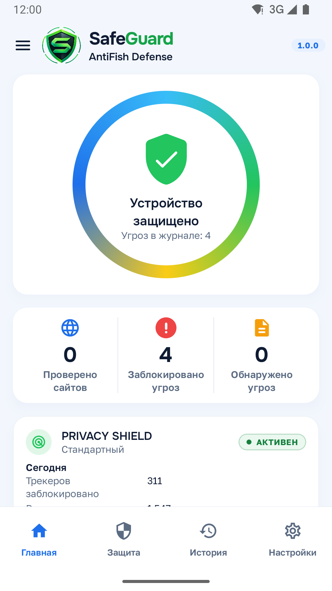
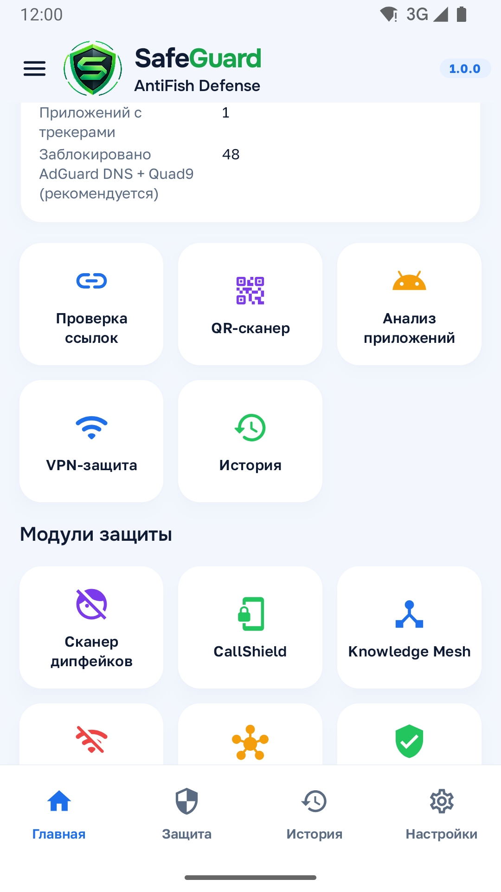

# 🛡️ SafeGuard AntiFish Defense    **Версия 1.0.0**

<div align="center">

### Защита от фишинга, интернет-мошенничества и цифровых угроз

**Проверяй. Думай. Будь в безопасности.**


[📱 **Скачать APK**](https://github.com/XuanCarlas/SafeGuard-AntiFish-Defense/releases/download/AntiFishing/SafeGuard-AntiFish-Defense-1.0.0.apk) 

</div>

---

## 🛡️ Что такое SafeGuard?

Android-приложение для дополнительной защиты от интернет-мошенничества, фишинга, опасных ссылок, подозрительных QR-кодов, вредоносных приложений и сетевых угроз.

<p align="center">




</p>

> **Получил ссылку → проверь → оцени риск → только потом открывай.**

## ⚡ Основные возможности

| Модуль | Что делает |
|---|---|
| 🔗 **Проверка ссылок** | Анализирует URL и выявляет признаки фишинга, мошенничества и подмены домена |
| 📷 **QR Scanner** | Проверяет содержимое QR-кода до открытия ссылки |
| 📞 **Проверка номеров** | Помогает предупреждать о подозрительных телефонных номерах |
| 📦 **APK Scanner** | Анализирует APK перед установкой |
| 🌐 **Secure Browser** | Проверяет ссылки до загрузки и открывает их во встроенном защищённом браузере |
| 🛡️ **Local VPN** | Дополнительный уровень сетевой фильтрации и защиты |
| 👁️ **Privacy Shield** | Помогает блокировать известные рекламные и tracking-домены |
| 🧠 **Heuristic Engine** | Ищет совокупность подозрительных признаков |
| 🧬 **YARA Scanner** | Использует YARA-правила при анализе доступных объектов |
| 🗃️ **IOC Database** | Проверяет индикаторы компрометации |
| 🎭 **Deepfake Scanner** | Локально анализирует поддерживаемые фото, видео и аудио на признаки AI-манипуляции |
| 🚫 **Network Quarantine** | Может ограничивать сетевой доступ приложения через механизм SafeGuard |
| 📊 **Security Journal** | Показывает события безопасности и обнаруженные угрозы |

## 🔗 Как проверяются ссылки?

```text
Полученная ссылка
       ↓
URL Normalization
       ↓
IOC / Threat Database
       ↓
Homograph / Punycode
       ↓
Heuristic Analysis
       ↓
Risk Engine
       ↓
ALLOW / WARN / BLOCK
```

SafeGuard анализирует структуру URL, домены и поддомены, Unicode/Punycode, смешение алфавитов, homograph-атаки, перенаправления, IOC и другие доступные признаки риска.

## 🌐 SafeGuard Secure Browser

```text
Messenger / Social Network / SMS
              ↓
          Web Link
              ↓
        SafeGuard
              ↓
      Security Gate
              ↓
       Risk Engine
              ↓
     Secure Browser
              ↓
          Website
```

Встроенный браузер добавляет проверку URL перед навигацией, повторный анализ перенаправлений, контроль опасных URI-схем, mixed content, cookies, известных trackers, загрузок, разрешений сайтов и TLS-ошибок.

> SafeGuard не обходит механизмы безопасности Android и не перехватывает ссылки скрытно.

## 📦 Проверка APK

```text
APK → SHA-256 → Manifest → Permissions → Certificate
    → IOC → YARA → Heuristics → Risk Engine → Security Report
```

SafeGuard помогает оценить потенциальный риск APK перед установкой. Финальное решение об установке принимает пользователь через стандартные механизмы Android.

## 🎭 Deepfake Scanner

Локальный модуль анализирует поддерживаемые **фото, видео и аудио** на признаки возможной AI-манипуляции.

```text
MEDIA → Preprocessing → Local Model → Artifact Analysis
      → Risk Evaluation → Result
```

Результат является оценкой риска, а не абсолютным доказательством подделки.

## 🛡️ Local VPN + Privacy Shield

```text
Android Apps
     ↓
SafeGuard Local VPN
     ↓
DNS / Domain / IP Analysis
     ↓
Threat Database
     ↓
Privacy Shield
     ↓
Policy Engine
     ↓
ALLOW / BLOCK
```

Privacy Shield помогает уменьшить количество известных рекламных, аналитических и tracking-запросов. SafeGuard показывает реальные события защиты и не должен использовать искусственные счётчики.

## 🧠 Risk Engine

```text
IOC + YARA + URL + Package + Network + Heuristics
                       ↓
               Threat Correlation
                       ↓
                  Risk Engine
                       ↓
      SAFE / LOW / MEDIUM / HIGH / CRITICAL
```

Один слабый сигнал сам по себе не должен автоматически означать наличие вредоносного ПО.

## 🔐 Конфиденциальность

SafeGuard создаётся по принципу **Privacy by Design**. Основные защитные функции по возможности выполняются непосредственно на устройстве.

Анализ безопасности не предназначен для сохранения паролей, PIN-кодов, CVV, OTP/SMS-кодов, приватных сообщений или содержимого форм авторизации. Функции обновления и онлайн-проверки репутации, если включены, могут использовать необходимые сетевые запросы.


## 🌍 Языки

•**Қазақша** •**Русский** •**English**

-----

## ⚠️ Важно

SafeGuard является дополнительным уровнем защиты. Ни одно защитное решение не может гарантировать обнаружение **100% существующих и будущих угроз**.

## 👨‍💻 Разработчик

**Куанышгали Ишимбаев**  
📧 kuanishgalii@gmail.com

---

<div align="center">

## 🛡️ SafeGuard AntiFish Defense
### Проверяй. Думай. Будь в безопасности.


</div>
